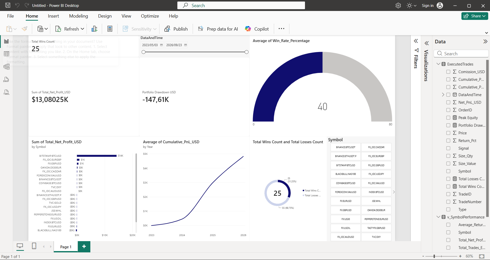
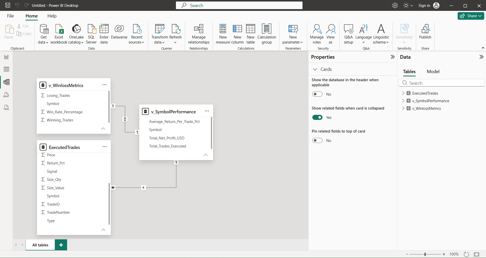

# 📈 End-to-End Trading Intelligence Data Pipeline & BI Dashboard

An enterprise-ready data architecture and analytics pipeline that ingests historical multi-asset transaction records, processes them through a relational database engine, and delivers interactive visual business intelligence.

---

## 🏆 Business Intelligence Dashboard Insights
The finalized operational analytics console delivers live interactive metrics for comprehensive strategy tracking:



---

## 🗂️ Project Repository Structure
This repository is organized into isolated layers to reflect standard production environment workflows:

```text
TradingHistoryDataAnalyticsPortfolio/
│
├── 🗄️ 01_db_and_table_schema-SQLQuery1.sql   # Database setup & strict table schema definitions
├── 🗄️ 02_data_ingestion-SQLQuery2.sql         # Transaction log history insertion scripts
├── 🗄️ 03_analytical_views-SQLQuery3.sql       # Pre-computed reporting queries and win/loss logic
├── 🐍 clean_trading_history.py                # Ingests TradingView files, parses dates, enforces types
├── 📊 TradingIntelligence_DataPipeline.pbix   # Development Power BI workbook asset
├── 🖼️ dashboard_preview.png                   # Active dashboard image asset
└── 🖼️ data_model_schema.png                    # Backend database mapping asset
```

---

## 🛠️ Data Pipeline Architecture

### Phase 1: Ingestion & Sanitation (Python)
The foundational dataset originates from raw text log exports. To ready fields for relational indexing, a **Python (Pandas & NumPy)** script performs automated ETL operations:
* Strips trailing whitespaces from core string headers via `.str.strip()`.
* Enforces explicit type safety on decimal cash flows via `pd.to_numeric()`.
* Exports sanitized rows into a standardized transactional flat file.

### Phase 2: Relational Warehousing (SQL Server)
Data is structured within a local instance named `TradingIntelligenceDB` running on **Microsoft SQL Server (T-SQL)**. 

To offload heavy performance computations from the visual reporting dashboard, calculations are handled directly on the database engine through pre-aggregated virtual views:
* **`v_SymbolPerformance`**: Groups metrics by asset ticker to isolate rolling volumes, gross margins, and baseline transaction counts.
* **`v_WinLossMetrics`**: Implements conditional aggregation arrays to extract strategy win splits. By filtering exclusively on market `Exit` legs, it eliminates calculation errors introduced by paired entry records.

```sql
CREATE VIEW v_WinLossMetrics AS
SELECT 
    Symbol,
    SUM(CASE WHEN Net_PnL_USD > 0 AND Type LIKE 'Exit%' THEN 1 ELSE 0 END) AS Winning_Trades,
    SUM(CASE WHEN Net_PnL_USD <= 0 AND Type LIKE 'Exit%' THEN 1 ELSE 0 END) AS Losing_Trades,
    CAST(SUM(CASE WHEN Net_PnL_USD > 0 AND Type LIKE 'Exit%' THEN 1 ELSE 0 END) * 100.0 / 
         (COUNT(TradeNumber) / 2) AS DECIMAL(5,2)) AS Win_Rate_Percentage
FROM ExecutedTrades
GROUP BY Symbol;
```

### 🔗 Semantic Data Model Architecture
The relational database layer forms a structured Star Schema joined dynamically across unified asset parameters inside Power BI:



### Phase 3: Advanced Metrics Engineering (DAX Engine)
Advanced portfolio health variables are computed on demand using explicit **Data Analysis Expressions (DAX)** inside the reporting dashboard layer:
* **True Realized Success Counter:** 
  ```dax
  Total Wins Count = COUNTROWS(FILTER(ExecutedTrades, ExecutedTrades[Net_PnL_USD] > 0 && (ExecutedTrades[Type] = "Exit short" || ExecutedTrades[Type] = "Exit long")))
  ```
* **Real-time Portfolio Drawdown Evaluation:** Continuously measures dynamic account equity variance from trailing historical capital high points down to current margins:
  ```dax
  Portfolio Drawdown USD = [Peak Equity] - SUM(ExecutedTrades[Cumulative_PnL_USD])
  ```

---

## 🏆 Business Impact & Visual Insights
The interactive analytics console surfaces high-level operation indicators for trading audits:
1. **Financial Health Monitoring**: Highlights **\$13.08M in gross portfolio profits** balanced against a formatted **-\$147.61K maximum historical account drawdown label**.
2. **Strategy Efficiency Measurement**: A radial speedometer tracking gauge validates an overall strategy **win rate of 40%**.
3. **Asset Revenue Distribution**: A sorted horizontal bar leaderboard maps individual asset class performance, highlighting `BITSTAMP:BTCUSD` as the leading revenue driver.
4. **End-User Interactivity**: Integrates high-visibility button tile slicers and chronological timeline banners, allowing users to instantly filter the entire data canvas by specific tokens or date parameters.

Developed by Jesus Kazaji | BCom Marketing Management & Analytics
